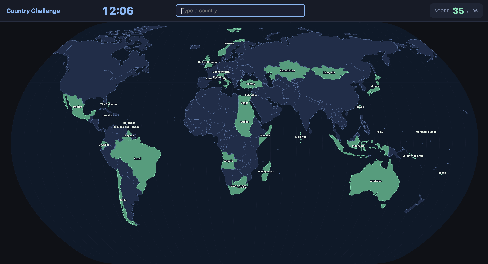

# Country Challenge

A geography game where you have 15 minutes to name as many countries as possible. Type a country name and press Enter — if it's correct, it lights up on the map.



## How to run

```bash
python3 -m http.server 8080
```

Then open [http://localhost:8080](http://localhost:8080) in your browser.
